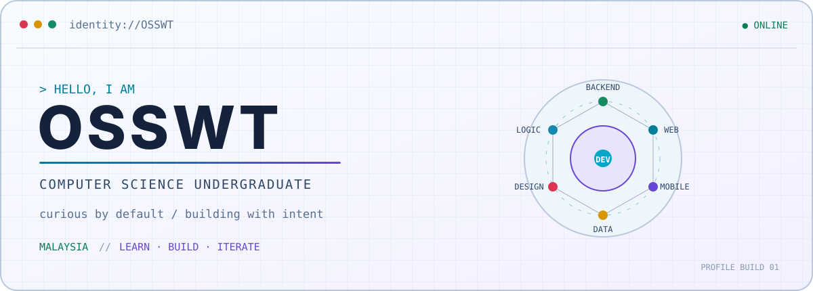
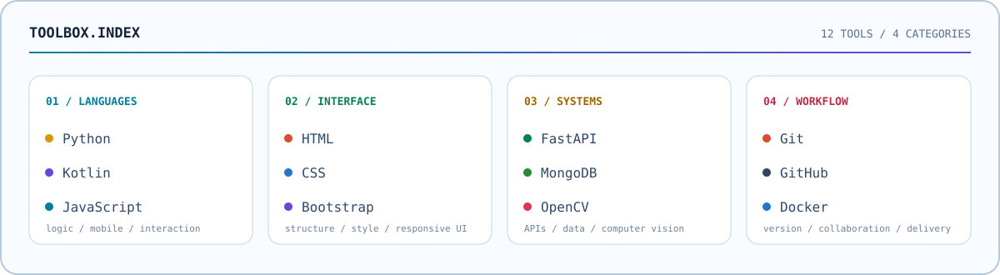

<picture>
  <source media="(max-width: 600px) and (prefers-color-scheme: dark)" srcset="assets/hero-mobile-dark.svg">
  <source media="(max-width: 600px)" srcset="assets/hero-mobile-light.svg">
  <source media="(prefers-color-scheme: dark)" srcset="assets/hero-dark.svg">
  <source media="(prefers-color-scheme: light)" srcset="assets/hero-light.svg">
  
</picture>

## `// ABOUT_ME`

I am a Computer Science undergraduate from Malaysia who enjoys understanding how software works and turning ideas into practical, thoughtful applications.

```text
mindset   curious by default
approach  learn deeply
          build thoughtfully
          improve continuously
interest  useful software
          clean interfaces
          dependable systems
```

## `// TECH_TOOLBOX`

<picture>
  <source media="(max-width: 600px) and (prefers-color-scheme: dark)" srcset="assets/toolbox-mobile-dark.svg">
  <source media="(max-width: 600px)" srcset="assets/toolbox-mobile-light.svg">
  <source media="(prefers-color-scheme: dark)" srcset="assets/toolbox-dark.svg">
  <source media="(prefers-color-scheme: light)" srcset="assets/toolbox-light.svg">
  
</picture>

## `// CURRENT_MODE`

<table>
  <tr>
    <td width="33%" valign="top">
      <strong>01 · LEARNING</strong><br><br>
      Deeper backend architecture, system design, and the reasoning behind reliable software.
    </td>
    <td width="33%" valign="top">
      <strong>02 · BUILDING</strong><br><br>
      Practical experiences across web, mobile, and API development.
    </td>
    <td width="33%" valign="top">
      <strong>03 · REFINING</strong><br><br>
      Cleaner code, clearer interfaces, and stronger problem-solving habits.
    </td>
  </tr>
</table>

## `// CONNECT`

Open to learning, collaboration, and ideas that turn into useful software.

<a href="https://github.com/OSSWT">
  <picture>
    <source media="(prefers-color-scheme: dark)" srcset="assets/connect-dark.svg">
    <source media="(prefers-color-scheme: light)" srcset="assets/connect-light.svg">
    
  </picture>
</a>

<sub>Designed as a quiet developer identity: less noise, more signal.</sub>
