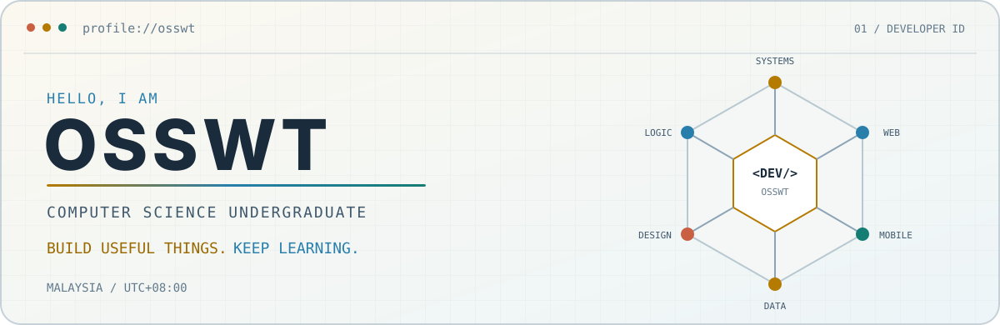
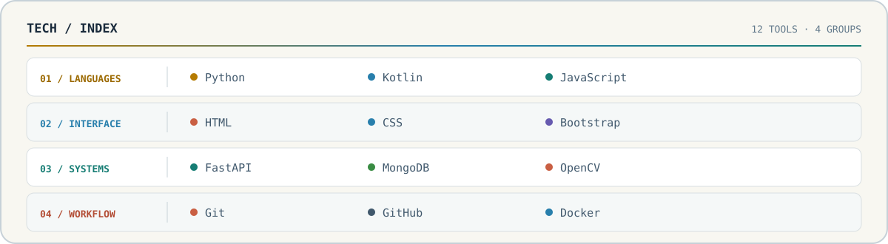

<picture>
  <source media="(max-width: 600px) and (prefers-color-scheme: dark)" srcset="assets/identity-mobile-dark.svg">
  <source media="(max-width: 600px)" srcset="assets/identity-mobile-light.svg">
  <source media="(prefers-color-scheme: dark)" srcset="assets/identity-dark.svg">
  <source media="(prefers-color-scheme: light)" srcset="assets/identity-light.svg">
  
</picture>

software should feel useful, clear, and dependable.

## 01 / About

I am a Computer Science undergraduate from Malaysia. I enjoy tracing how systems work, shaping clear interfaces, and turning rough ideas into software people can actually use.

## 02 / Toolbox

<picture>
  <source media="(max-width: 600px) and (prefers-color-scheme: dark)" srcset="assets/stack-mobile-dark.svg">
  <source media="(max-width: 600px)" srcset="assets/stack-mobile-light.svg">
  <source media="(prefers-color-scheme: dark)" srcset="assets/stack-dark.svg">
  <source media="(prefers-color-scheme: light)" srcset="assets/stack-light.svg">
  
</picture>

## 03 / Current direction

- **Systems** — learning deeper backend architecture and system design.
- **Craft** — building across web, mobile, and API development.
- **Quality** — improving code clarity and thoughtful product decisions.

BUILD USEFUL THINGS · KEEP LEARNING

